## 📊 Slides de présentation

> Projet Data Engineering — Itinéraire de Vacances  
> Backend Python • API REST • Data Pipelines • Monitoring

  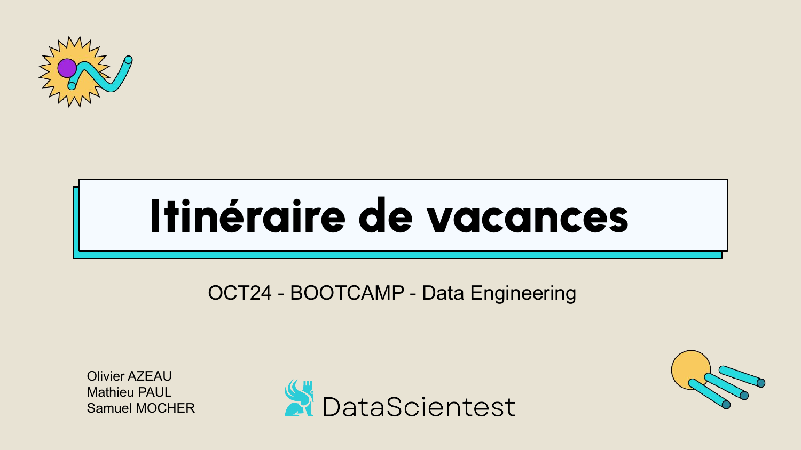  
  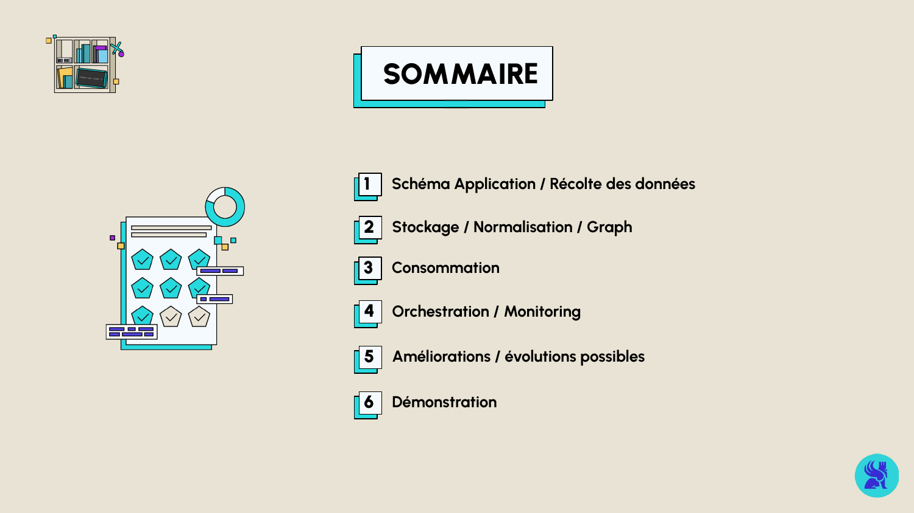  
  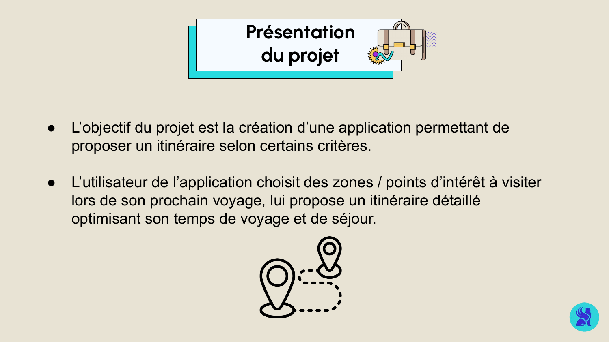  
  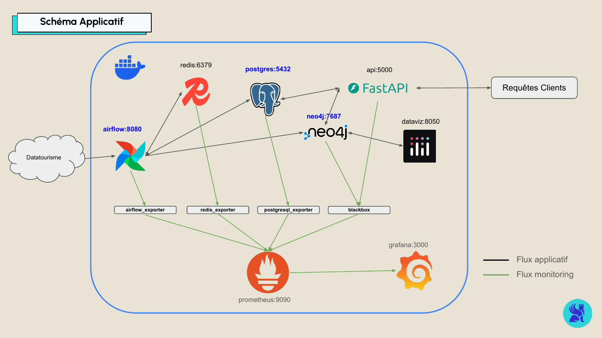  
  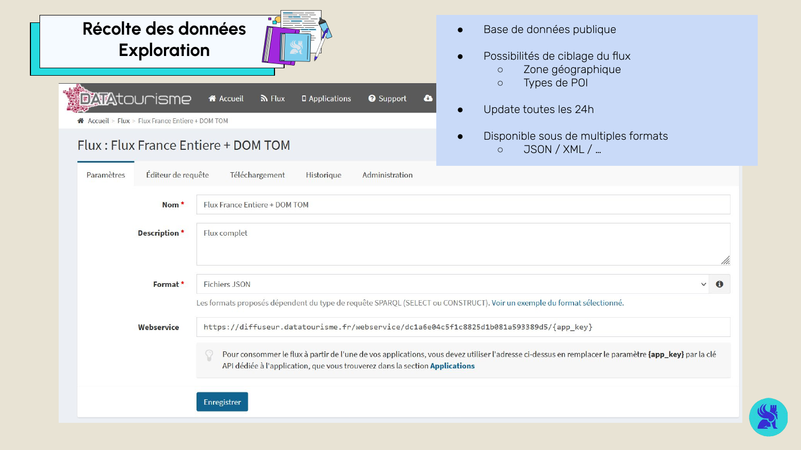  
  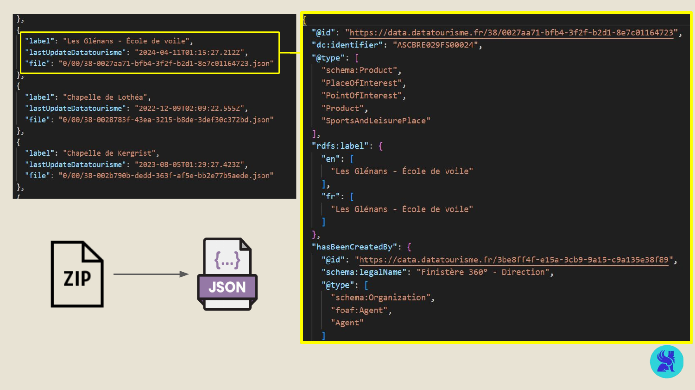  
  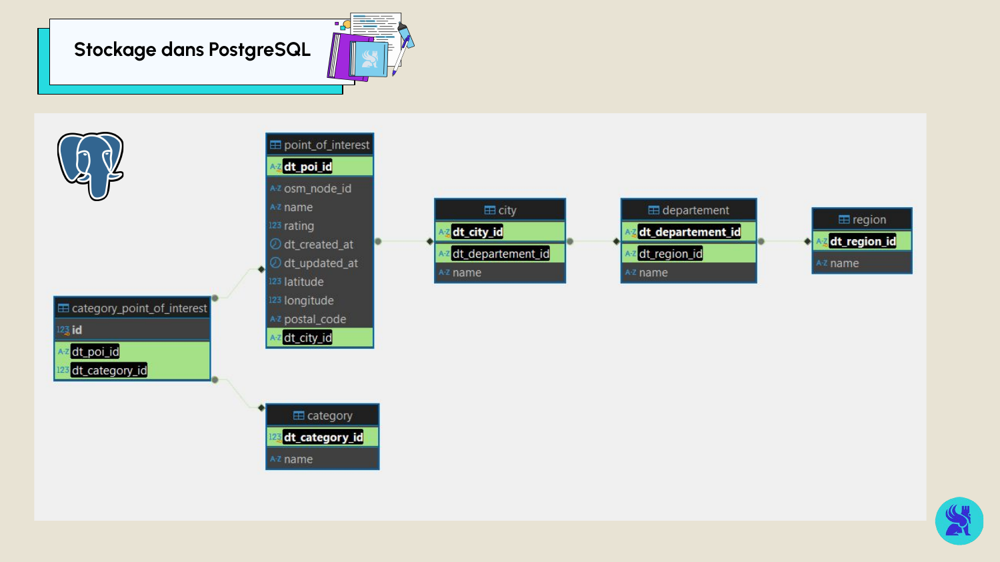  
  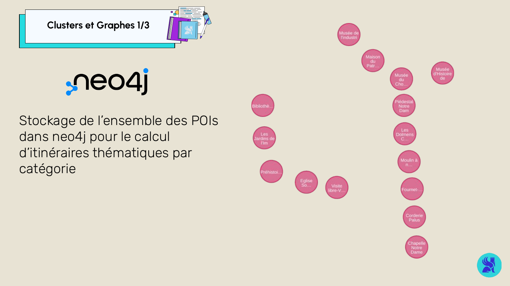  
  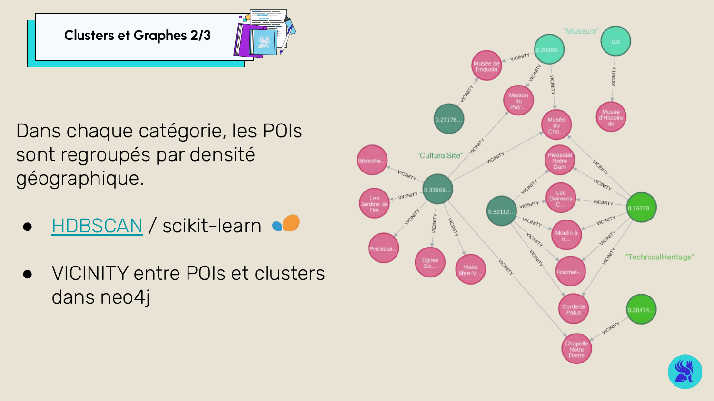  
  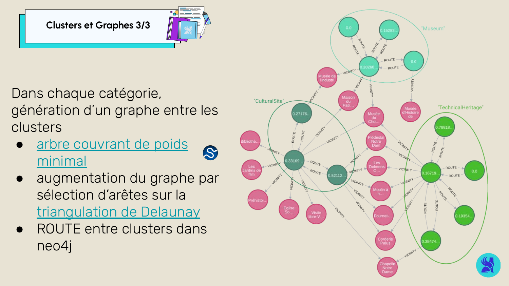  
  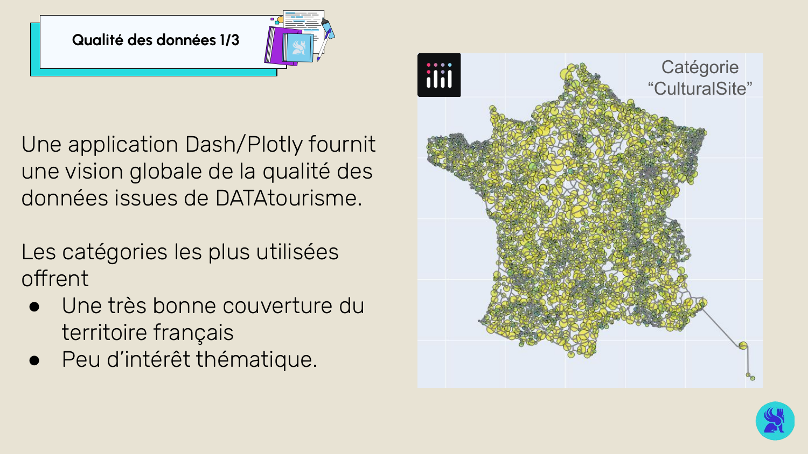  
  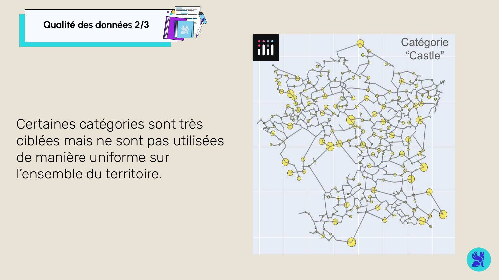  
    
  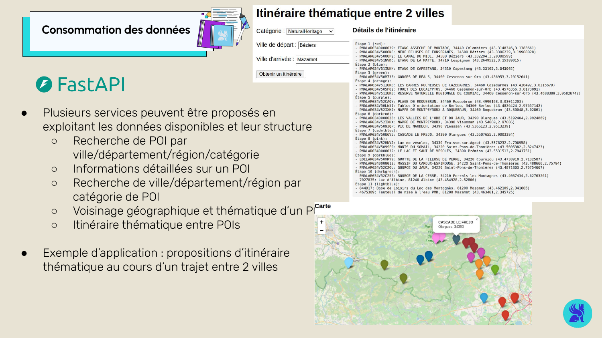  
  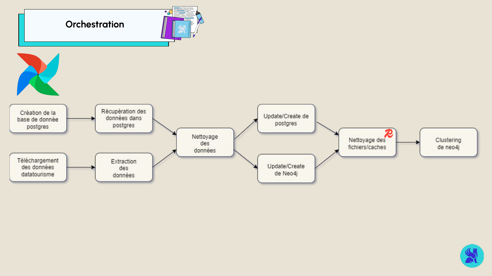  
  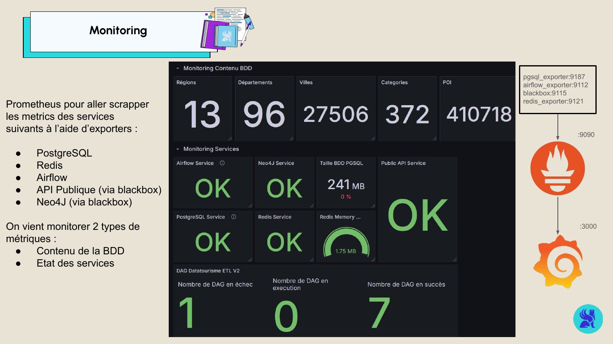  
  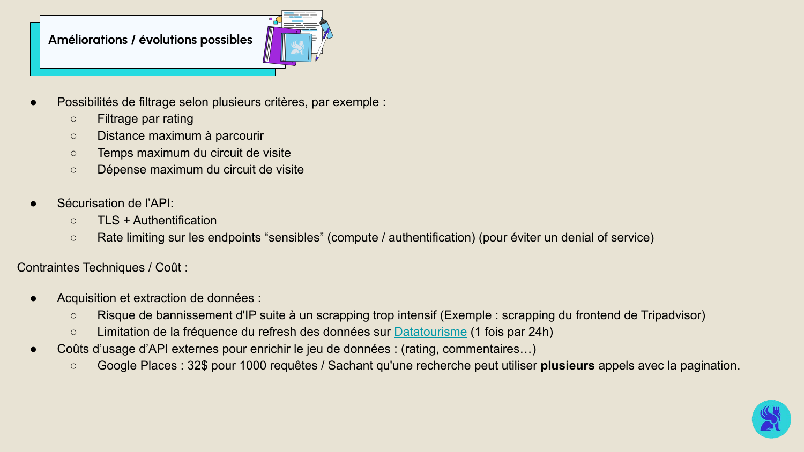

